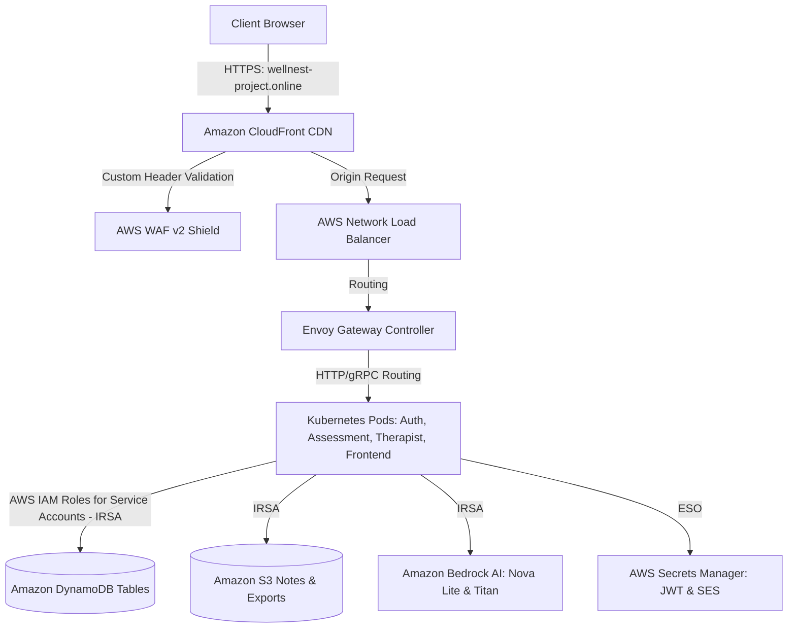

# 🌿 CalmRoot Production EKS Deployment Guide (From Scratch)

This step-by-step implementation guide walk you through deploying the **CalmRoot** microservices platform onto a fresh, empty AWS account (`006805625766`) using Amazon EKS, Terraform, Helm, Envoy Gateway, CloudFront CDN, and GitHub Actions.

---

## 🏗️ Architecture Flow

The following diagram illustrates how the components fit together in production:



---

## 📋 Prerequisites & Tools

Ensure the following tools are installed and configured on your local administration machine:

* **AWS CLI** (configured with AdministratorAccess access keys for AWS account `006805625766`)
* **Node.js** (v18 or v20)
* **Docker Desktop** (running locally to build and push container images)
* **Terraform CLI** (v1.5+)
* **kubectl** & **Helm** (installed locally to manage and inspect Kubernetes resources)
* **Git** (configured and authenticated to push code to GitHub)

---

## 🏁 Phase 1: Create Database Tables & S3 Storage

Because your AWS account is brand new and empty, we must initialize the DynamoDB tables and S3 bucket. We do this **first** because Terraform is configured to read these resources as `data` sources (protecting existing state/data from accidental teardowns).

1. **Install dependencies in the root folder**:
   ```bash
   npm install
   ```
   *This installs the necessary `@aws-sdk/client-dynamodb` and `@aws-sdk/client-s3` packages.*

2. **Initialize AWS Resources**:
   Run the utility script to create the 6 DynamoDB tables and the `calmroot-clinical-notes-006805625766` S3 bucket in `us-east-1`:
   ```bash
   npm run create-resources
   ```

3. **Verify in the AWS Console**:
   * Navigate to **DynamoDB ➔ Tables** in `us-east-1`. You should see `calmroot-users`, `calmroot-sessions`, `calmroot-assessment-templates`, `calmroot-assessments`, `calmroot-mood-logs`, and `calmroot-therapist-patients`.
   * Navigate to **S3 ➔ Buckets**. You should see `calmroot-clinical-notes-006805625766`.

---

## 🛠️ Phase 2: Bootstrap Backend & GitHub Actions OIDC

Next, we need to create the remote state storage for Terraform and configure a secure connection between GitHub Actions and your AWS account using OpenID Connect (OIDC).

1. **Bootstrap Terraform Remote State**:
   Run the backend setup script. This creates the S3 bucket `calmroot-terraform-state` (with versioning and encryption enabled) and the DynamoDB lock table `calmroot-terraform-locks` to prevent concurrent terraform executions:
   ```bash
   bash scripts/setup-terraform-backend.sh
   ```

2. **Setup GitHub Actions OIDC IAM Role**:
   Create the trust relationship and deploy role on AWS:
   ```bash
   bash scripts/setup-github-oidc.sh
   ```
   *This registers the GitHub OIDC provider and creates a role named `calmroot-github-actions-role` with AdministratorAccess credentials.*

3. **Configure GitHub Repository Secrets**:
   Copy the output Role ARN and configure them as secrets in your GitHub repository (**Settings ➔ Secrets and variables ➔ Actions ➔ Repository Secrets**):
   * Add `AWS_ROLE_ARN` with value: `arn:aws:iam::006805625766:role/calmroot-github-actions-role`
   * Add `AWS_REGION` with value: `us-east-1`

---

## 🏗️ Phase 3: Run Terraform Pass 1 (Core Infrastructure)

We deploy EKS and network resources first. Because the Network Load Balancer (NLB) DNS is generated *after* Envoy Gateway runs inside EKS, CloudFront and Route 53 DNS routing are decoupled in a two-pass setup.

### Pass 1: Provision VPC, EKS, KMS, and ECR

1. Confirm that `terraform/terraform.tfvars` contains:
   ```hcl
   nlb_dns_name = "placeholder.example.com"
   ```
   *(Keep the placeholder. Do not change it yet!)*

2. **Commit and push your repository to trigger the pipeline**:
   ```bash
   git add .
   git commit -m "infra: bootstrap core infrastructure"
   git push origin main
   ```

3. **Approve GHA Plan Workflow**:
   * Go to the **Actions** tab of your repository on GitHub.
   * Select the **Infrastructure — Terraform** workflow run.
   * Wait for the "Terraform Plan" job to finish.
   * Click **Review deployment** and select the `production` environment to approve the plan.
   * Let the workflow complete the **Terraform Apply** phase (takes roughly 15-20 minutes to spin up the VPC, EKS Cluster, EKS Node groups, KMS keys, and ECR repositories).

4. **Delegate your Domain (DNS Setup)**:
   * Once Terraform finishes successfully, find the Route 53 Nameservers in the console or standard output.
   * Log in to your domain registrar (GoDaddy, Namecheap, Domain.com, etc.).
   * Locate the custom DNS configuration for your domain **`wellnest-project.online`**.
   * Replace the default registrar nameservers with the **4 AWS Route 53 Nameservers** provided by your Route 53 Hosted Zone.
   * *Note: DNS propagation may take a few minutes to hours. You can track progress at [dnschecker.org](https://dnschecker.org).*

---

## 🔐 Phase 4: Bedrock, SES & Secret Values Setup

Before deploying the pods, we must request Bedrock access, configure our mail service, and update Secrets Manager. All production secrets (JWT secret, SMTP credentials) are stored securely in **AWS Secrets Manager** and synchronized into EKS using the **External Secrets Operator (ESO)**.

1. **Verify AWS SES Domain/Email Identity**:
   * Navigate to the AWS Console ➔ **Amazon Simple Email Service (SES)** ➔ **Identities**.
   * Click **Create Identity**, select **Email address**, enter your sender email.
   * Verify the identity by clicking the link in the verification email sent by AWS.

2. **Populate Secrets Manager values**:
   * Open [scripts/update-secrets.sh](file:///c:/Users/bhara/OneDrive/Desktop/CalmRoot/scripts/update-secrets.sh).
   * Note: The script is already pre-configured with your Gmail SMTP settings (`bharath70135@gmail.com` and app password). Make sure `JWT_SECRET` is set to a secure random key.
   * Run the script:
     ```bash
     bash scripts/update-secrets.sh
     ```
   *This updates the secrets inside the AWS Secrets Manager (`calmroot/prod/ses` and `calmroot/prod/jwt`).*

3. **Enable AWS Bedrock AI Access**:
   * Navigate to AWS Console ➔ **Amazon Bedrock** in `us-east-1` (N. Virginia).
   * In the left menu, select **Model access**.
   * Click **Manage model access** on the top right.
   * Check the boxes to request access for:
     * **Amazon Nova Lite** (used for therapist summary agents)
     * **Amazon Titan Text Express** (used for admin bot chat engines)
   * Save changes. Access is granted instantly for these models.

---

## ⛵ Phase 5: Build, Ship & Deploy Application (Pass 1)

You must build and push the Docker images for the 4 microservices to Amazon ECR so that EKS can pull them. You can choose either the automated pipeline (highly recommended) or the manual build/push process from your command line.

### Option A: Automated Build & Push via GitHub Actions (Recommended)
1. Go to the **Actions** tab on your GitHub repository.
2. Select the **Deploy — Build & Ship to EKS** workflow from the left sidebar.
3. Click the **Run workflow** dropdown on the right side and run it against the `main` branch.
4. This pipeline uses the `AWS_ROLE_ARN` OIDC role to:
   * Authenticate your GitHub runner with Amazon ECR.
   * Set up `docker buildx` to build images for `linux/amd64` architecture.
   * Tag them with the git commit SHA and `latest`, and push them to ECR.
   * Install EKS operators (Gateway API, Metrics Server, External Secrets, Load Balancer Controller, and Envoy Gateway) and deploy CalmRoot services via Helm.

---

### Option B: Manual Build & Push via Local CLI
If you prefer to manually build and push the images from your local terminal:

1. **Authenticate Docker with AWS ECR**:
   ```bash
   aws ecr get-login-password --region us-east-1 | docker login --username AWS --password-stdin 006805625766.dkr.ecr.us-east-1.amazonaws.com
   ```

2. **Build and Tag the Backend microservices**:
   Run the following commands in the CalmRoot root directory:
   ```bash
   # Build & Tag Auth Service
   docker build -t 006805625766.dkr.ecr.us-east-1.amazonaws.com/calmroot/auth-service:latest ./services/auth-service
   
   # Build & Tag Assessment Service
   docker build -t 006805625766.dkr.ecr.us-east-1.amazonaws.com/calmroot/assessment-service:latest ./services/assessment-service
   
   # Build & Tag Therapist Service
   docker build -t 006805625766.dkr.ecr.us-east-1.amazonaws.com/calmroot/therapist-service:latest ./services/therapist-service
   ```

3. **Build and Tag the Frontend with Production Endpoint Configurations**:
   ```bash
   docker build --build-arg VITE_AUTH_URL=https://wellnest-project.online \
                --build-arg VITE_ASSESSMENT_URL=https://wellnest-project.online \
                --build-arg VITE_THERAPIST_URL=https://wellnest-project.online \
                --build-arg VITE_CHATBOT_ENABLED=true \
                -t 006805625766.dkr.ecr.us-east-1.amazonaws.com/calmroot/frontend:latest ./services/frontend
   ```

4. **Push the images to ECR**:
   ```bash
   docker push 006805625766.dkr.ecr.us-east-1.amazonaws.com/calmroot/auth-service:latest
   docker push 006805625766.dkr.ecr.us-east-1.amazonaws.com/calmroot/assessment-service:latest
   docker push 006805625766.dkr.ecr.us-east-1.amazonaws.com/calmroot/therapist-service:latest
   docker push 006805625766.dkr.ecr.us-east-1.amazonaws.com/calmroot/frontend:latest
   ```

5. **Deploy CalmRoot via Helm (If doing manually)**:
   ```bash
   helm upgrade --install calmroot ./helm/calmroot \
     -n calmroot-prod --create-namespace \
     --set global.image.tag=latest \
     --set global.image.registry=006805625766.dkr.ecr.us-east-1.amazonaws.com \
     -f helm/calmroot/values-prod.yaml
   ```

---

---

## 🌐 Phase 6: CloudFront & Domain Bindings (Pass 2)

Now that Envoy Gateway has spun up a Network Load Balancer, we fetch the NLB DNS endpoint and configure CloudFront CDN to route to it.

1. **Fetch Envoy Load Balancer address**:
   Run the following commands locally to fetch the NLB DNS address:
   ```bash
   # Connect local kubectl to the new EKS cluster
   aws eks update-kubeconfig --name calmroot-prod --region us-east-1
   
   # Retrieve Envoy Gateway NLB Address
   kubectl get gateway calmroot-gateway -n calmroot-prod -o jsonpath='{.status.addresses[0].value}'
   ```
   *Example Output: `calmroot-nlb-123456789.elb.us-east-1.amazonaws.com`*

2. **Configure Pass 2 variables**:
   Open [terraform/terraform.tfvars](file:///c:/Users/bhara/OneDrive/Desktop/CalmRoot/terraform/terraform.tfvars) and replace the placeholder `nlb_dns_name` with your actual NLB DNS URL:
   ```hcl
   nlb_dns_name = "calmroot-nlb-123456789.elb.us-east-1.amazonaws.com"
   ```

3. **Commit and Push to trigger final infrastructure bind**:
   ```bash
   git add terraform/terraform.tfvars
   git commit -m "infra: update nlb endpoint for cloudfront CDN"
   git push origin main
   ```

4. **Approve GHA Plan Workflow**:
   * Go back to the **Actions** tab of your repository on GitHub.
   * Approve the **Infrastructure — Terraform** run.
   * This final run configures:
     * **ACM Certificate Validation**: Validates the SSL certificates for `wellnest-project.online` and `*.wellnest-project.online`.
     * **AWS WAF v2**: Creates rate-limiting and security rules.
     * **CloudFront CDN**: Configures CDN caching and origin routing, pointing directly to the NLB using a custom header validation key.
     * **Route 53 DNS Alias Records**: Maps A records from your custom domain directly to the CloudFront distribution endpoint.

---

## 🔍 Phase 7: Verification & Testing

Verify that your pods are running and services are securely accessible.

### 1. Pod Verification
Ensure all pods show `Running` status:
```bash
kubectl get pods -n calmroot-prod
```

### 2. External Secrets Sync
Verify that Secrets Manager keys are synchronized to EKS Secrets correctly:
```bash
kubectl get externalsecrets -n calmroot-prod
```
*Expected status:* `SecretSynced`

### 3. API Health & Performance Checks
Run test curl requests or open in browser:

* **Frontend Page**: Open `https://wellnest-project.online/` in your browser. (Verify SSL lock icon is present).
* **Auth Service Status**:
  ```bash
  curl -i https://wellnest-project.online/api/auth/health
  # Should respond HTTP 200 OK
  ```
* **Rate-limiting Check**:
  Verify the Envoy Gateway rate limiter kicks in when spamming the endpoint:
  ```bash
  # In Bash/Zsh:
  for i in {1..25}; do curl -i https://wellnest-project.online/api/chat/health; done
  # You should receive HTTP 429 Too Many Requests after 20 attempts
  ```

---

## 🛠️ Troubleshooting

| Issue | Potential Cause | Resolution |
| :--- | :--- | :--- |
| **Pods stuck in `ImagePullBackOff`** | ECR repository mapping mismatch or tag issue. | Run `kubectl describe pod <pod-name> -n calmroot-prod` to check ECR registry path. Ensure the build pipeline has pushed that tag. |
| **Secrets not syncing (`SecretNotSynced`)** | IAM role mapping mismatch on AWS Secrets Manager. | Run `kubectl describe externalsecret calmroot-secrets -n calmroot-prod` to see detailed errors. Ensure Secrets Manager contains `calmroot/prod/jwt` and `calmroot/prod/ses`. |
| **`NS` nameservers don't resolve** | DNS Registrar propagation delay. | Validate nameserver configuration at [dnschecker.org](https://dnschecker.org). Can take up to 24 hours (usually under 5 mins). |
| **502 Bad Gateway / CloudFront Error** | The CloudFront custom header header mismatch or NLB DNS is not responding. | Confirm that `nlb_dns_name` in `terraform.tfvars` matches the output of `kubectl get gateway calmroot-gateway -n calmroot-prod`. |
| **Bedrock API fails inside container** | Model access is disabled or IRSA lacks Bedrock permissions. | Go to AWS Console ➔ Bedrock ➔ Model Access to check access. Verify EKS pod role permission for action `bedrock:InvokeModel`. |
