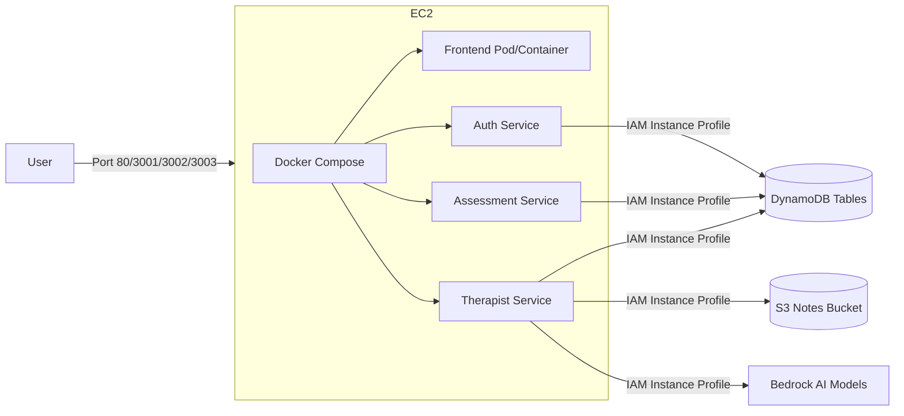

# 🌿 CalmRoot: Complete Scratch-to-Production Deployment Guide

This document provides complete, step-by-step instructions to deploy the **CalmRoot** application in your brand new AWS Account (`006805625766`). 

We will deploy in two main stages:
1. **Stage 1 (Single EC2 Host)**: Deploy the application on a single EC2 instance using Docker Compose and Docker containers, pointing to real AWS DynamoDB tables and S3 buckets. This will allow you to quickly verify the application behavior.
2. **Stage 2 (Amazon EKS Cluster)**: Migrate and scale the application into a production-ready Amazon EKS cluster with Envoy Gateway, CloudFront CDN, AWS WAF, and SSL/TLS.

---

## 🛠️ Stage 1: Run application on a single EC2 instance using Docker



### 1.1 Create the EC2 IAM Instance Profile
To securely allow your microservices running in Docker on EC2 to access AWS resources (DynamoDB, S3, Bedrock) without hardcoding secret keys:
1. Open the **AWS Console** and go to **IAM ➔ Roles**.
2. Click **Create Role**. Select **AWS service** as the trusted entity and **EC2** as the use case.
3. Attach the following policies:
   * **`AmazonDynamoDBFullAccess`**
   * **`AmazonS3FullAccess`**
   * **`AmazonBedrockFullAccess`**
4. Name the role **`calmroot-ec2-app-role`** and create it.

---

### 1.2 Provision the EC2 Instance
1. Go to **EC2 ➔ Instances** and click **Launch Instances**.
2. **Name**: `calmroot-dev-host`
3. **OS Image**: Select **Amazon Linux 2023 AMI** (Free tier eligible).
4. **Instance Type**: Select **`t3.medium`** (Recommended to prevent Node builds/Docker compilation from running out of memory) or **`t2.micro`** if restricted.
5. **Key Pair**: Choose an existing key pair or create a new one to SSH into the instance.
6. **Network Settings**:
   * Create a new Security Group allowing:
     * SSH (`Port 22`) from your IP.
     * HTTP (`Port 80`) from Anywhere.
     * Port `3001` (Auth), `3002` (Assessment), `3003` (Therapist) from Anywhere (for direct testing).
7. **Configure Storage**: Set size to **20 GiB** GP3 SSD.
8. **Advanced Details**:
   * Under **IAM instance profile**, select **`calmroot-ec2-app-role`**.
9. Click **Launch Instance**.

---

### 1.3 Create the DynamoDB & S3 Resources (from Local Admin Machine)
We need to create the DynamoDB tables and S3 bucket on your new AWS account (`006805625766`).
1. Make sure your local terminal is configured with administrative credentials for account `006805625766`:
   ```bash
   aws sts get-caller-identity
   # Confirm it shows Account ID: 006805625766
   ```
2. Navigate to your local CalmRoot folder:
   ```bash
   cd c:\Users\bhara\OneDrive\Desktop\CalmRoot
   ```
3. Install dependencies and run the resource creator:
   ```bash
   npm install
   npm run create-resources
   ```
   *This creates your 6 DynamoDB tables and the `calmroot-clinical-notes-006805625766` bucket in `us-east-1`.*

---

### 1.4 Request Bedrock Model Access
1. In the AWS Console, switch to region **`us-east-1`** (N. Virginia).
2. Navigate to **Amazon Bedrock ➔ Model Access**.
3. Click **Manage model access** in the top right.
4. Select the checkboxes for:
   * **Amazon Nova Lite**
   * **Amazon Titan Text Express**
5. Save changes. Access will be granted immediately.

---

### 1.5 Setup and Launch the App on the EC2 Host
1. **SSH into your EC2 Instance**:
   ```bash
   ssh -i "your-key.pem" ec2-user@<ec2-public-ip>
   ```

2. **Update the system and install Docker & Git**:
   ```bash
   sudo dnf update -y
   sudo dnf install -y git docker
   sudo systemctl start docker
   sudo systemctl enable docker
   
   # Add ec2-user to docker group (re-login to apply)
   sudo usermod -aG docker ec2-user
   exit
   ```
   *(Now SSH back in to apply group permissions)*
   ```bash
   ssh -i "your-key.pem" ec2-user@<ec2-public-ip>
   ```

3. **Install Docker Compose**:
   ```bash
   sudo curl -L "https://github.com/docker/compose/releases/latest/download/docker-compose-$(uname -s)-$(uname -m)" -o /usr/local/bin/docker-compose
   sudo chmod +x /usr/local/bin/docker-compose
   docker-compose --version
   ```

4. **Clone your CalmRoot Repository**:
   ```bash
   git clone https://github.com/Bharath-1602/CalmRoot.git
   cd CalmRoot
   ```

5. **Configure the Environment Variables**:
   Create a `.env` file in the root folder. Include your SMTP credentials for testing (e.g. Gmail App Password, AWS SES SMTP credentials, or SendGrid keys):
   ```bash
   cat <<EOF > .env
   JWT_SECRET=supersecretjwtkeyforcalmroottesting123
   FRONTEND_URL=http://<ec2-public-ip>:80
   AWS_REGION=us-east-1
   NODE_ENV=production
   
   # SMTP Email Settings
   SMTP_HOST=smtp.gmail.com
   SMTP_PORT=587
   SMTP_USER=bharath70135@gmail.com
   SMTP_PASS=zdzbvnwrspyzhhps
   SMTP_FROM=bharath70135@gmail.com
   EOF
   ```
   *(Be sure to replace `<ec2-public-ip>` with your EC2 public IP or domain name)*

6. **Start the Application Containers**:
   ```bash
   docker-compose up -d --build
   ```
   *This builds the Dockerfiles for your frontend, auth, assessment, and therapist services concurrently and starts them.*

7. **Verify the App runs**:
   * Run `docker ps` to verify all 4 containers (`calmroot-frontend`, `calmroot-auth`, `calmroot-assessment`, `calmroot-therapist`) are up and healthy.
   * Open `http://<ec2-public-ip>:80` in your web browser. You should be able to log in, register, create clinical notes, and access the assistant bot!

---
---

## ⛵ Stage 2: Migrate and Deploy to AWS EKS (Production)

Once you've verified the Docker Compose app is working on the EC2 instance, you are ready to transition to a highly available, enterprise EKS infrastructure.

### 2.1 Setup Remote State & GitHub Actions OIDC
On your local machine, run the setup scripts to bootstrap Terraform state and OIDC roles in your new AWS Account `006805625766`:

1. **Bootstrap Terraform S3 Remote State Bucket**:
   ```bash
   bash scripts/setup-terraform-backend.sh
   ```
   *Creates the state bucket `calmroot-terraform-state` and locks table `calmroot-terraform-locks`.*

2. **Register GitHub Actions OIDC role**:
   ```bash
   bash scripts/setup-github-oidc.sh
   ```
   *Creates the role `calmroot-github-actions-role` in your AWS IAM.*

3. **Configure GitHub Secrets**:
   Go to your GitHub repository (**Settings ➔ Secrets and variables ➔ Actions ➔ Repository Secrets**):
   * Add `AWS_ROLE_ARN` = `arn:aws:iam::006805625766:role/calmroot-github-actions-role`
   * Add `AWS_REGION` = `us-east-1`

---

### 2.2 Terraform Pass 1 (Core Infrastructure)
1. In [terraform/terraform.tfvars](file:///c:/Users/bhara/OneDrive/Desktop/CalmRoot/terraform/terraform.tfvars), confirm `nlb_dns_name` is set to the default placeholder:
   ```hcl
   nlb_dns_name = "placeholder.example.com"
   ```
2. Commit and push code to your `main` branch to trigger the pipeline:
   ```bash
   git add .
   git commit -m "infra: deploy core EKS cluster"
   git push origin main
   ```
3. Open the **Actions** tab on your GitHub repository. Select the **Infrastructure — Terraform** run.
4. When the Plan stage finishes, click **Review deployment** and approve the `production` gate.
5. Once complete, copy the **4 Route 53 Nameservers** outputted in the GHA logs.
6. Replace your registrar's nameservers for **`wellnest-project.online`** with these 4 AWS Nameservers.

### 2.3 Secrets & Verification Setup
To ensure no hardcoded credentials exist in production, all secrets (JWT secret, SMTP credentials) are stored securely in **AWS Secrets Manager** and synchronized into EKS using the **External Secrets Operator (ESO)**.

1. **Verify AWS SES Domain/Email Identity**:
   * Navigate to the AWS Console ➔ **Amazon Simple Email Service (SES)** ➔ **Identities**.
   * Verify your sender email address.
2. **Update the Secrets seeding script**:
   * Open [scripts/update-secrets.sh](file:///c:/Users/bhara/OneDrive/Desktop/CalmRoot/scripts/update-secrets.sh) in your editor.
   * Fill in your secure production `JWT_SECRET`.
   * Fill in your production SMTP settings:
     * `SMTP_HOST`: The SMTP server address (e.g. `email-smtp.us-east-1.amazonaws.com` if using Amazon SES SMTP, `smtp.gmail.com` if Gmail, etc.).
     * `SMTP_PORT`: Port (typically `587` or `465`).
     * `SMTP_USER`: The authenticated SMTP username.
     * `SMTP_PASS`: The authenticated SMTP password.
     * `SMTP_FROM`: The sender email (which must be verified in your SES identity).
3. **Execute the script locally**:
   ```bash
   bash scripts/update-secrets.sh
   ```
   *This updates the secrets inside the AWS Secrets Manager (`calmroot/prod/ses` and `calmroot/prod/jwt`).*

---

### 2.4 Build and Push Images to Amazon ECR (Manual vs. Automated)

You must build and push the Docker images for the 4 microservices to Amazon ECR so that EKS can pull them. You can either use the automated GitHub Actions pipeline (highly recommended) or build and push them manually from your local command line.

#### Option A: Automated Build & Push via GitHub Actions (Recommended)
1. Go to the **Actions** tab on your GitHub repository.
2. Select the **Deploy — Build & Ship to EKS** workflow from the left sidebar.
3. Click the **Run workflow** dropdown on the right side and run it against the `main` branch.
4. This pipeline uses the `AWS_ROLE_ARN` role to log in to Amazon ECR, sets up `docker buildx` to build images for `linux/amd64` architecture, tags them with the git commit SHA and `latest`, and pushes them to your ECR repositories.
5. In addition to building/pushing, it installs the EKS controllers (Gateway API CRDs, Metrics Server, External Secrets Operator, Load Balancer Controller, and Envoy Gateway) and deploys your microservices via Helm.

---

#### Option B: Manual Build & Push via Local CLI
If you want to manually build and push the images from your local machine (with local Docker Desktop running), execute the following commands step-by-step:

1. **Authenticate your local Docker CLI with AWS ECR**:
   ```bash
   aws ecr get-login-password --region us-east-1 | docker login --username AWS --password-stdin 006805625766.dkr.ecr.us-east-1.amazonaws.com
   ```
   *Note: If you receive an authentication error, make sure your AWS CLI profile is set to Account `006805625766`.*

2. **Build and Tag the backend microservice images**:
   Navigate to the CalmRoot root directory on your terminal and run:
   ```bash
   # Build & Tag Auth Service
   docker build -t 006805625766.dkr.ecr.us-east-1.amazonaws.com/calmroot/auth-service:latest ./services/auth-service
   
   # Build & Tag Assessment Service
   docker build -t 006805625766.dkr.ecr.us-east-1.amazonaws.com/calmroot/assessment-service:latest ./services/assessment-service
   
   # Build & Tag Therapist Service
   docker build -t 006805625766.dkr.ecr.us-east-1.amazonaws.com/calmroot/therapist-service:latest ./services/therapist-service
   ```

3. **Build and Tag the Frontend image with Production endpoints**:
   The frontend requires specific build-time variables so the React client can reach the microservices through the custom domain in production:
   ```bash
   docker build --build-arg VITE_AUTH_URL=https://wellnest-project.online \
                --build-arg VITE_ASSESSMENT_URL=https://wellnest-project.online \
                --build-arg VITE_THERAPIST_URL=https://wellnest-project.online \
                --build-arg VITE_CHATBOT_ENABLED=true \
                -t 006805625766.dkr.ecr.us-east-1.amazonaws.com/calmroot/frontend:latest ./services/frontend
   ```

4. **Push the images to AWS ECR**:
   Push each of the built images to their respective ECR repositories:
   ```bash
   docker push 006805625766.dkr.ecr.us-east-1.amazonaws.com/calmroot/auth-service:latest
   docker push 006805625766.dkr.ecr.us-east-1.amazonaws.com/calmroot/assessment-service:latest
   docker push 006805625766.dkr.ecr.us-east-1.amazonaws.com/calmroot/therapist-service:latest
   docker push 006805625766.dkr.ecr.us-east-1.amazonaws.com/calmroot/frontend:latest
   ```

5. **Deploy the Helm Chart manually (If not using GitHub Actions)**:
   If you manually built the images and want to trigger EKS deployment locally:
   ```bash
   helm upgrade --install calmroot ./helm/calmroot \
     -n calmroot-prod --create-namespace \
     --set global.image.tag=latest \
     --set global.image.registry=006805625766.dkr.ecr.us-east-1.amazonaws.com \
     -f helm/calmroot/values-prod.yaml
   ```

---

### 2.5 Bind CloudFront CDN & SSL (Pass 2)
1. Retrieve the DNS address of the newly provisioned Network Load Balancer (NLB):
   ```bash
   aws eks update-kubeconfig --name calmroot-prod --region us-east-1
   kubectl get gateway calmroot-gateway -n calmroot-prod -o jsonpath='{.status.addresses[0].value}'
   ```
   *Output format: `calmroot-nlb-*.elb.us-east-1.amazonaws.com`*

2. Open [terraform/terraform.tfvars](file:///c:/Users/bhara/OneDrive/Desktop/CalmRoot/terraform/terraform.tfvars) and replace the placeholder `nlb_dns_name` with the NLB DNS URL:
   ```hcl
   nlb_dns_name = "calmroot-nlb-xxx.elb.us-east-1.amazonaws.com"
   ```

3. Commit and push:
   ```bash
   git add terraform/terraform.tfvars
   git commit -m "infra: link CloudFront CDN to NLB"
   git push origin main
   ```

4. Go to **Actions ➔ Infrastructure — Terraform** workflow, and approve the deploy run.
   *This links the secure HTTPS domain `wellnest-project.online`, WAF ACLs, CloudFront CDN, and Route 53 A-alias records to the NLB.*

---

### 2.6 Verify Production EKS Status
Check if EKS is successfully running your services:
```bash
# Verify Pod Statuses
kubectl get pods -n calmroot-prod

# Verify Secrets syncing
kubectl get externalsecrets -n calmroot-prod

# Test routing
curl -i https://wellnest-project.online/api/auth/health
```
Your deployment is complete! 🚀
